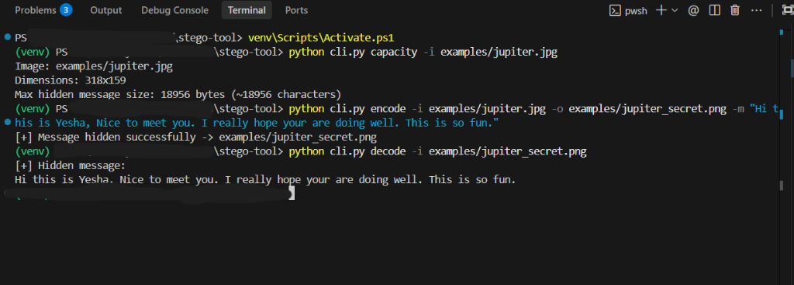

# Steganography Tool

Hide secret messages inside PNG images using LSB (Least Significant Bit)
steganography, with an optional password-based encryption layer for
defense in depth.

## Why this exists

Steganography hides the *existence* of a message; cryptography hides its
*meaning*. This tool demonstrates both — and shows how combining them is
stronger than either alone.

## How it works

Every pixel has RGB channels stored as 8-bit values (0-255). Flipping the
last bit of a channel changes its value by at most 1 — invisible to the
human eye. We overwrite the LSB of each color channel with one bit of the
secret message:

```
Original:  11010110  (214)
Message bit: 1
Modified:  11010111  (215)   <- visually identical, carries 1 bit of data
```

A 32-bit header is written first, storing the message length in bytes, so
`decode()` knows exactly when to stop reading — no delimiter collisions,
no guessing.

```
[ 32-bit length header ][ message bits, length * 8 ]
```

### Proof it's invisible

On a 400x300 test image, hiding a 48-character message changed only
**123 out of 120,000 pixels (0.10%)**, with a maximum single-channel
value shift of **1 out of 255**. Side-by-side, the images are
indistinguishable.

## Project structure

```
stego-tool/
├── stego.py          # core encode/decode engine
├── utils.py           # bit/byte conversion, capacity math
├── crypto_layer.py    # optional password-based encryption (PBKDF2 + Fernet)
├── cli.py             # command-line interface
├── test_stego.py       # unit tests (stdlib unittest, no pytest needed)
├── examples/
│   └── cover.png       # sample cover image for demos
└── README.md
```

## Usage

Below is a visualization of the Command Line Interface in action:



### Command Tree & Explanations

Here is a breakdown of the commands and options demonstrated in the screenshot:

#### 1. Check Capacity (`capacity`)
Checks the selected local cover image dimensions and calculates the maximum message size (in bytes/characters) that can be hidden in its Least Significant Bits.
```bash
python cli.py capacity -i examples/jupiter.jpg
```
* **Parameters**:
  * `-i`, `--image`: Path to the input cover image.
* **Command Outcome**: Reads the image width and height, computes the total available pixels, and lists the capacity. For example, a small `318x159` image can store up to **18,956 bytes (~18,956 characters)**.

#### 2. Hide a Message (`encode`)
Encodes a text message into the Least Significant Bits of the cover image and writes the result to a new, lossless output image (PNG format).
```bash
python cli.py encode -i examples/jupiter.jpg -o examples/jupiter_secret.png -m "Hi this is Yesha, Nice to meet you. I really hope your are doing well. This is so fun."
```
* **Parameters**:
  * `-i`, `--image`: Path to the input cover image.
  * `-o`, `--output`: Path to write the output steganographic image.
  * `-m`, `--message`: The text payload to hide.
  * `--encrypt` *(optional)*: Pass this flag to encrypt the message using password-based encryption (AES Key derived via PBKDF2).
* **Command Outcome**: Confirms successful hiding and saves the new image file. Side-by-side, the output is indistinguishable from the input.

#### 3. Extract the Message (`decode`)
Extracts and demonstrates the hidden plaintext payload stored within the Least Significant Bits of the steganographic PNG file.
```bash
python cli.py decode -i examples/jupiter_secret.png
```
* **Parameters**:
  * `-i`, `--image`: Path to the steganographic image file.
  * `--encrypt` *(optional)*: Pass this flag if the message was encrypted during encoding. You will be prompted securely for the password.
* **Command Outcome**: Directly parses and prints the hidden message to the console.

---

### Additional CLI Examples

#### With Encryption (password protected)
```bash
python cli.py encode -i examples/cover.png -o secret.png -m "Sensitive payload" --encrypt
python cli.py decode -i secret.png --encrypt
```
(Omit `--password` on the CLI to be prompted securely instead of typing it in plaintext on the command line.)

## Running tests
```bash
python3 -m unittest test_stego.py -v
```

## Design notes / decisions

- **PNG only for output.** Steganography requires lossless storage — JPEG
  compression would destroy the LSB data. The tool always saves output as
  PNG regardless of input format.
- **Length header over delimiter.** An early design used a `#####` stop
  sequence, but that risks colliding with binary message content.
  Prefixing a fixed 32-bit length header is deterministic and simpler to
  reason about.
- **Password-based encryption is optional and separable.** `crypto_layer.py`
  doesn't know anything about images, and `stego.py` doesn't know anything
  about encryption — the CLI just pipes bytes through both. Each piece is
  independently testable.

## Limitations & detection (interview talking points)

- **LSB steganography is statistically detectable.** Because natural
  images have some noise, LSB overwrites are often *not* visually
  detectable, but they change the statistical distribution of the image's
  bit-planes. A **chi-square attack** compares the expected vs. observed
  frequency of even/odd pixel value pairs to flag likely LSB-stego images
  — it doesn't recover the message, but it can flag "something's hidden
  here."
- **Recompression / resizing destroys the payload.** Any lossy
  transformation (JPEG re-save, resizing, format conversion) will corrupt
  or destroy the hidden bits — this is *not* a robust watermarking scheme.
- **Encryption raises the bar, not the ceiling.** Even if an attacker
  detects and extracts the hidden payload, without the password it's an
  opaque Fernet token protected by PBKDF2-HMAC-SHA256 (480,000 iterations,
  OWASP's 2023+ recommended minimum).
- **Real-world relevance:** LSB steganography techniques have been
  observed in malware C2 channels (hiding payloads/config in seemingly
  normal images) and covert data exfiltration — this project mirrors
  detection-relevant mechanics a SOC analyst should recognize, not just
  "how to hide a secret message."

## Requirements

```
Pillow
cryptography   # only needed for the --encrypt / -d --encrypt paths
```
